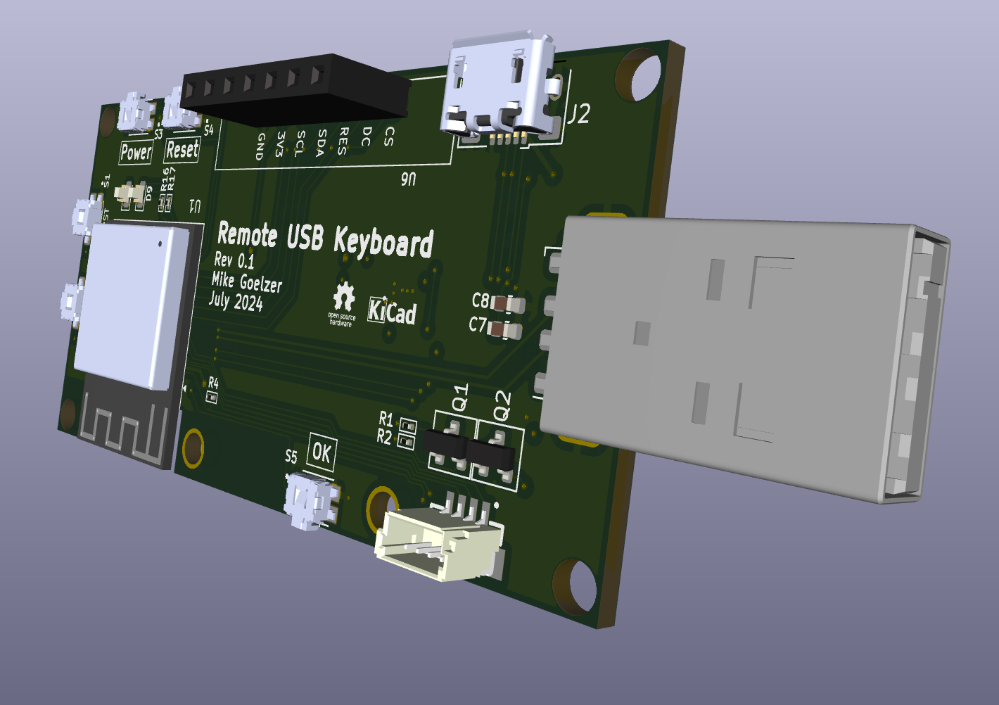

# USB HID Keyboard over Wifi

  

This project is the hardware and firmware for an ESP32-based remote USB keyboard. It's a dongle that plugs into a USB port on a computer and sends keystrokes that it receives over Wifi.  The connector `J3` also allows for wiring up to the PC motherboard's `F_PANEL` control pins, allowing for remote on/off and remote reboot.  

If you run a JST 4-conductor wire to `F_PANEL` there is a small adapter PCB that plugs it into the motherboard connector.

  

## Hardware

There are two Kicad projects, one for the USB key and one for the small adapter PCB:

  - USB keyboard PCB
    - [Schematic](Schematics/USBHIDKey.pdf)
    - [`USBHIDKey`](USBHIDKey/)
  - Adapter PCB
    - [Schematic](Schematics/F_PANEL_Shim.pdf)
    - [`F_PANEL_Adapter`](F_PANEL_Adapter/)

## Firmware

The firmware is in the [`esp32-firmware`](esp32-firmware/) directory. See its [README](esp32-firmware/usb-hid-kybd/README.md) for details.